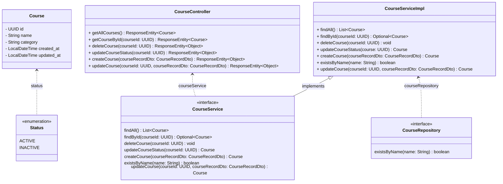

# Challenge 01 - Rocketseat

## About the project
This project was developed as part of the [Rocketseat Java course](https://app.rocketseat.com.br/journey/java/contents).

## Project goals
Create a REST API for a programming course company. At this first moment, this should be a CRUD API.

API functionalities:

- create a new course
- list all courses
- update a course by id
- remove a course by id

## Used technologies
- Java
- Spring Boot
- Spring Data
- Docker
- Maven
- Apache Tomcat
- Postman

## Project architecture

In this project, we'll try to apply the Hexagonal Architecture, following the folder structure below:
```src
+-- adapters
|   +-- input
|       +-- controllers
|   +-- output
|       +-- repositories
+-- application
|   +-- services
|   +-- usecases
+-- domain
|   +-- course
+-- infrastructure
```

`adapters`: communication with the outside world  
`adapters/input/controllers`: REST controllers  
`adapters/output/repositores`: repositories interfaces  
`application`: business logic and rules  
`application/services`: services implementation  
`application/usecases`: services interfaces  
`infrastructure`: tool configuration (spring, sdk, libraries, etc.)  
`domain`: domain entities  
`domain/course`: course entity  

## Class diagram
